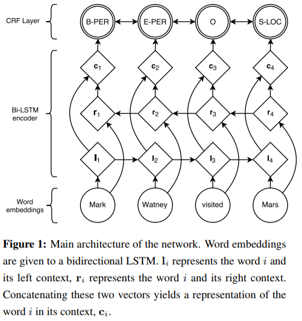
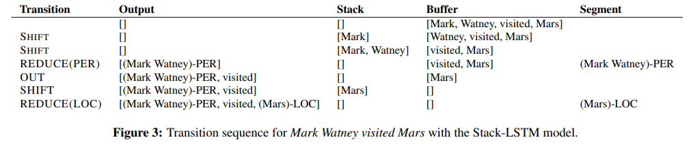
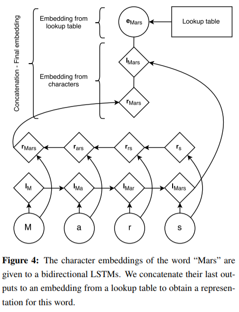

[TOC]

----------------------------------------------------

### [Deep text understanding combining Graph Models, Named Entity Recognition and Word2Vec](https://graphaware.com/nlp/2018/09/10/deep-text-understand-combining-graphs-ner-word2vec.html)

__以前工作__

-  [Maximum Entropy Markov Models for Information Extraction and Segmentation](http://www.ai.mit.edu/courses/6.891-nlp/READINGS/maxent.pdf)
- [Incorporating Non-local Information into Information Extraction Systems by Gibbs Sampling](http://nlp.stanford.edu/~manning/papers/gibbscrf3.pdf)
- [Neural architectures for named entity recognition](https://www.aclweb.org/anthology/N16-1030)

__数据__

- Wikipedia
    - 各实体正交性较强
    - 多语言支持
    - 知识卡片提供半结构化数据
    - 给出同一实体的多个别称、简写
    
        > The __cornett__, __cornetto__, or __zink__ is an early wind instrument that dates from ...
    
    - 指代、简写识别：Stanford CoreNLP

__NER 模型__

- 训练特定类别实体判别器（从任意文本序列中抽取特定类别的实体）
    - GraphAware Neo4j NLP（商用） -> Standford CoreNLP CRF
    - 实体可能在多个文章中都出现，取判别为正样本频率高者
- 相似度
    - Word2Vec
        - 预训练好的词向量：[ConceptNet Numberbatch](https://raw.githubusercontents.com/commonsense/conceptnet-numberbatch)（含中文）
        - 在已有词向量库上添加新的实体描述向量

----------------------------------------------

<small><b>==TODO:==</b> 原始 HMM、CRF 太旧了，这里先跳过。</small>

----------------------------------------------

### [Neural Architectures for Named Entity Recognition](https://www.aclweb.org/anthology/N16-1030)

__Code__

- [LSTM-CRF](https://github.com/glample/tagger)
- [Stack-LSTM](https://github.com/clab/stack-lstm-ner)

__LSTM-CRF Model__

- ~~听说使用隐层 $\mathbf{h}_t$ 作为判断是否为实体名称的依据很有效？？~~

考虑输入序列

$$
\mathbf{X} = (\mathbf{x}_1, \mathbf{x}_2, \dots, \mathbf{x}_n)
$$

经过 (Bi-)LSTM 得到输出矩阵 $\mathbf{P} \in \R^{n \times k}$，其中 $k$ 为标签类型数目（# of distinct tags）。

则有对输出标签序列

$$
\mathbf{y} = (y_1, y_2, \dots, y_n) \ ,
$$

可定义该预测的得分由如下公式得出（CRF）

$$
\begin{align}
&s(\mathbf{X}, \mathbf{y}) = \overbrace{\sum_{i=0}^{n} A_{y_i, y_{i+1}}}^\text{上下文联系得分} + \overbrace{\sum_{i=1}^{n} P_{i, y_i}}^\text{词对实体预测得分} \\
\text{其中，}&A_{i,j} \text{表示从 tag }i\text{ 到 tag }j\text{ 的一个“语境得分”} \\
&\hspace{1em}（\mathbf{A} \in \R^{(k+2) \times (k+2)}\text{，算上起始标签与结束标签}） \\
\end{align}
$$

> 非 CRF 模型直接用输出序列 $\mathbf{y}$ 对 ground-truth 取 SoftMax 即可。

训练目标即为最大化 $$s$$ 最高的预测方式的概率。

$$
\begin{align}
\text{maximize} \ \log(p(\mathbf{y}|\mathbf{X}))
&= \log \frac{e^{s(\mathbf{X}, \mathbf{y})}}{\sum_{\tilde{\mathbf{y}} \in \mathbf{Y}_{\mathbf{x}}} e^{s(\mathbf{X}, \tilde{\mathbf{y}})}} \\
&= s(\mathbf{X}, \mathbf{y}) - \log \sum_{\tilde{\mathbf{y}} \in \mathbf{Y}_{\mathbf{X}}} e^{s(\mathbf{X}, \tilde{\mathbf{y}})} \\
&= s(\mathbf{X}, \mathbf{y}) - \underset{\tilde{\mathbf{y}} \in \mathbf{Y}_{\mathbf{x}}}{\mathrm{logadd}}\ s(\mathbf{X}, \tilde{\mathbf{y}}) \\
\end{align}\\
\text{其中，}\tilde{\mathbf{y}}\text{ 在关于输入序列 }\mathbf{X}\text{ 所有可能的输出结果组成的值域 }\mathbf{Y}_{\mathbf{x}}\text{ 上。}
$$

> 实现见 [src](https://github.com/glample/tagger/blob/master/model.py#L284)。源码中左右界符在 tag 集中下标分别为 #1, #0。

|  |
| :----------------------------------------------------------: |
|                     LSTM-CRF 模型示意图                      |

__Transition-Based Chunking Model__

- Stack-LSTM (Dyer et al., 2015)
    - 数据结构
        1. 输入缓冲区
        2. 处理栈
        3. 输出缓冲区
    - 操作
        1. `SHIFT`：输入区中取一个入栈
        2. `REDUCE(y)`：栈中符号规约为标志 `y`，入输出区
        3. `OUT`：从输入区中取一个符号直接入输出区

|  |
| :----------------------------------------------------------: |
|                     S-LSTM 操作过程示例                      |

> 简单来说就是编译原理 + 强化学习。

- 扩展词向量
    - 考虑到语言中，意思相近 / 有延申含义的词通常有相近的词根，故考虑使用字序列信息（Bi-LSTM 输出）扩展原词向量。

|  |
| :----------------------------------------------------------: |
|                     字序列信息扩展词向量                     |

------------------------------------------------

### [CharNER: Character-Level Named Entity Recognition](https://www.aclweb.org/anthology/C16-1087)

[code](https://github.com/ozanarkancan/char-ner)

优点：

- 词缀、大小写、标点符号不敏感
- 语言不敏感
- 错误拼写不敏感
- 嵌入向量位于形态学上更抽象维度

